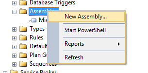

# Extensión SQL Server

##### Para utilizar los dll, se debe ejecutar en el motor las siguientes instrucciones:

##### SQL configuración ejecución CLR en Sql Server 
```SQL
EXEC sp_configure 'clr enabled' , '1'
RECONFIGURE
```

Posteriormente, se debe cargar la DDL en la base de datos correspondiente:
##### 1. Desplegar la base de datos en la cual se agregara la ddl 

##### 2. Marcar New Assembly...

##### 3. Buscar en la ruta correspondiente el ddl generado por el proyecto

##### 4. Se cargará en la carpeta Assemblies la DDL con su nombre correspondiente


#### Finalmente, se debe crear la función en SQL que llame al contenido de nuestra DLL

##### SQL ejemplo función escalar  
```SQL
CREATE FUNCTION dbo.nombreFunción
(
      @Expression NVARCHAR(255) --Aqui van los parametros a pasar a la ddl 
)
RETURNS FLOAT
AS EXTERNAL NAME 
   [extensionSQLServerProject].[UserDefinedFunctions].[EvaluateFunction]
GO
```

**_Nota: Se debe revisar el archivo EXTENSIONSQLSERVERPROJECT.generated.sql ubicado en ...extensionSQLServerProject\obj\Debug para conocer el nombre asociado al EXTERNAL NAME_**
